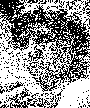
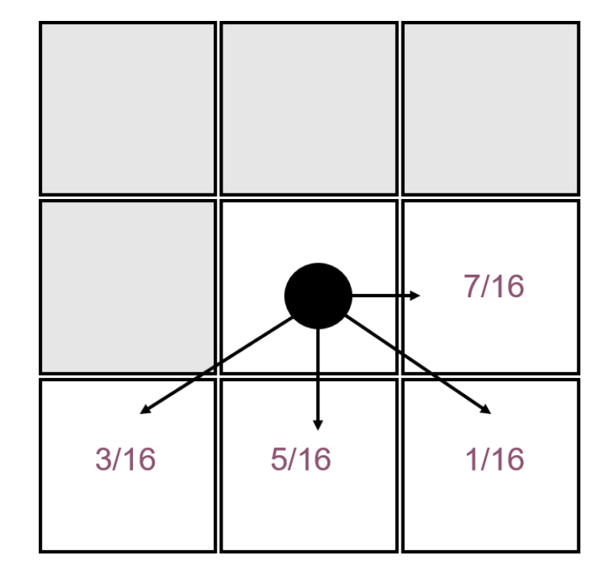
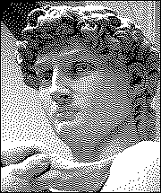
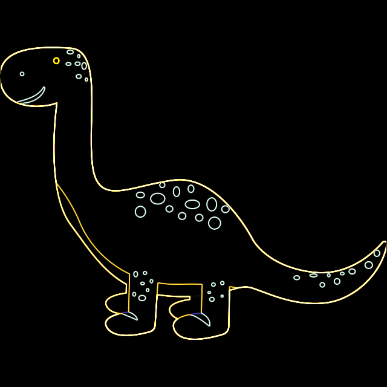
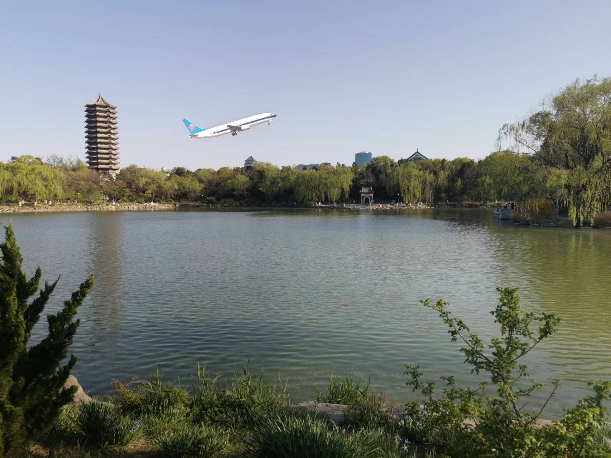
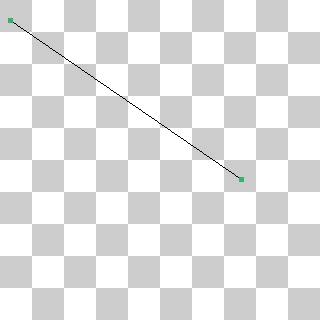
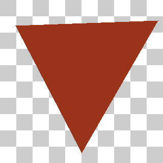
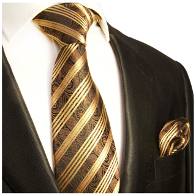
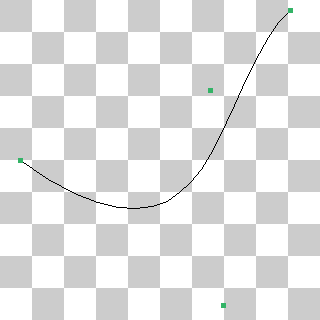

## Lab1 实验报告

注意点是一些基础知识回顾或是实现时出过错的地方

#### Task 1-2 Uniform Random

###### **实现思路**

1.通过观察可以知道每个像素点的rgb值在[0,1]之间，故设置随机数生成器，等概率生成-0.5到0.5之间的实数。

2.遍历整个画布上的像素点，对每个像素点用随机数生成器生成一个扰动，该像素点的rgb值都加上这个扰动

3.用threshold算法，该点r值大于0.5则设置为1否则为0，gb值同理。

**注意点：**对于每一个像素点的rgb值扰动是一样的，而不是对rgb分别生成一个扰动。这是白噪声，频率均匀分布。

###### **实现效果**

<p align="center">
  
</p>

#### Task 1-3 Blue Noise Random

###### **实现思路**

1.遍历整个画布上的像素点，对每个像素点横纵坐标取模得到蓝噪声背景上的对应坐标，记录蓝噪声背景的颜色为noise_color

2.将noise_color的rgb值都减去0.5使其变为[-0.5,-0.5]的扰动，加到input的对应像素点上

3.用threshold算法，该点r值大于0.5则设置为1否则为0，gb值同理。

**注意点：**扰动的rgb值都需要减去0.5使其范围从图上的[0,1]变为[-0.5,0.5]。这是蓝噪声，在高频区域更为集中，而人眼对低频信号敏感，难以察觉高频信号存在，故看上去比白噪声更为拟真。

**实现效果**

<p align="center">
  
</p>


#### Task 1-4 Ordered

###### **实现思路**

1.设置3*3抖动矩阵 

```C++
double m[3][3]={{6,8,4},{1,0,3},{5,2,7}};
```

2.遍历整个画布上的所有像素点(x,y)，记其颜色为color，对每一个像素点遍历抖动矩阵m[xx] [yy]。

3.对于每个input像素，output上应该有9个像素表示颜色。那么对于(x,y)和(xx,yy)，在output上的像素位置应该是(3*x+xx,3*y+yy)。如果color>m[xx] [yy]/9.0，那么这个位置的颜色就是1，否则为0。

**注意点**：

1.输入虽然是灰度图，但是每个位置都应该对rgb分别计算，而不是先算出一个统一的灰度

2.m[xx] [yy]/9.0是为了将1-9映射到0-1内，为了得到小数必须要除以浮点数9.0而非整数9

3.得到的图像比input大3倍

###### 实现效果

<p align="center">
  
</p>


#### Task 1-5 Error Diffuse

###### 实现思路

1.创建一个缓冲图像buffer=input

2.遍历每一个像素，从buffer处读出相应的颜色color并做threshold算法得到color_to_be，画到output上

3.做误差扩散，将color-color_to_be作为误差，按照图示比例扩散到buffer的相邻格子中。

<p align="center">
  
</p>

**注意点**

1.input是const类型无法修改，需要复制一份到buffer。

2.顺序是步骤2-步骤3，每次遍历到这个像素就直接对他进行threshold操作并画到画布上，再将误差扩散到还未画到画布上的像素中（存在buffer里），已经画上去的不会动。

3.注意越界问题。

###### 实现效果

<p align="center">
  
</p>

#### Task 2-1 Blur

###### 实现思路

1.设置3*3卷积核

```C++
double kernel[3][3]={{1.0/9,1.0/9,1.0/9},{1.0/9,1.0/9,1.0/9},{1.0/9,1.0/9,1.0/9}};
```

2.遍历每个像素点并对其进行卷积

**注意点**

1.边界条件，防止越界

2.glm::vec3仅支持浮点数操作，需要将卷积核转为float形式（或者一开始定义时即为float类型）

###### 实现效果

<p align="center">
  
</p>


#### Task 2-2 Edge

###### 实现思路

1.设置横向边界和纵向边界的卷积核

```C++
double kernel1[3][3]={{-1,0,1},{-2,0,2},{-1,0,1}};
double kernel2[3][3]={{1,2,1},{0,0,0},{-1,-2,-1}};
```

2.遍历input的所有像素点，分别对kernel1和kernel2做卷积，得到color1和color2

3.输出图像对应像素点的值为

```C++
output.At(x,y)=sqrt(color1*color1+color2*color2);
```

**注意点**

这是Sobel-Feldman滤波器，使用了一阶导推导，因为包含了取模长操作，所以是非线性滤波器。两个kernal分别提取了x方向和y方向的梯度，对另一个方向进行了模糊。

对二阶导推导则可以得到Laplacian卷积核。

###### 实现效果

<p align="center">
  
</p>

#### Task 3 Image Inpainting

###### 实现思路

这个task帮我们完成了最复杂的部分，我们只需完成初始化的部分。但是我将尝试解释所有代码的逻辑。

1.输入的offset是一个二维向量，表示inputFront的左上角在inputBack上的像素位置。首先将output赋值为inputBack。inputFront的长宽分别为width和height.

2.设g为最终结果output和inputFront在inputFront区域的差值，为了方便之后的矩阵运算，将g设为向量的格式，长度为width*height.

如下三个点指的是同一位置：

```
inputFront[x][y]
inputBack[offset.x+x][offset+y]
g[y*width+x]
```

3.核心思路：

记f为inputBack,F为inputFront，g为编辑量
$$
\nabla^2f=\nabla^2(f+g)
$$

$$
g|_{\partial\Omega}=f|_{\partial\Omega}-F|_{\partial\Omega}
$$

其中(1)可以化简为
$$
\nabla^2 g=0
$$
也即
$$
\frac {\partial^2 g}{\partial x^2}+\frac{\partial^2 g}{\partial y^2}=0
$$
用有限差分近似，取差分为1，有
$$
g(i+1,j)+g(i-1,j)+g(i,j+1)+g(i,j-1)-4g(i,j)=0
$$
这里为了方便表示将g 写成了矩阵的形式，实际上它是一个一维向量。

于是，解(4)式也就是解方程
$$
\textbf{A}g=0
$$
其中**A** 为Laplace矩阵。在4*4的情形下，形如
$$
\begin{bmatrix}
\begin{matrix}-4&1&0&1
\\1&-4&1&0 
\\0&1&-4&0
\\1&0&0&-4

\end{matrix}

\end{bmatrix}
$$
对于更大的矩阵同理。

 (2)则是我们要补充代码的初始条件。

4.具体实现

由(2)推知我们必须处理边界上的点作为初始值。分成水平方向和竖直方向两端处理。

对竖直方向，遍历y，分别计算横坐标为offset.x和offset.x+width-1的像素点在inputBack和outputBack的差值。存入的g的坐标可以用上面的坐标等价结论得到。

水平方向遍历x，计算纵坐标为offset.y和offset.y+height-1的像素点在inputBack和outputBack的差值。

这样我们根据(2)补全了代码。

对于(1)采用Jacobi迭代的方法。
$$
g_{i,j}=\frac{1}{4}(g_{i+1,j}+g_{i-1,j}+g_{i,j+1}+g_{i,j-1})
$$

```C++
g_new(i,j) = 0.25 * (g_old(i+1,j) + g_old(i-1,j) + g_old(i,j+1) + g_old(i,j-1))
```

但是注意到给出的代码直接复用了部分已经更新过的g而非全部使用旧值，故其使用的应当是Gauss-Seidel算法，通过8000次迭代得到一个近似解。

5.最终处理

将得到的g加到inputFront上即得到output在此像素处的值

**注意点**

按照这个方法而非讲义上的方法处理的好处在于可以直接解右边为0向量的方程组。在**A**是**稀疏的、对称正定**（如 Laplace 矩阵）时，Gauss–Seidel 比 Jacobi **收敛更快**。

###### 实现效果

<p align="center">
  
</p>


#### Task 4 Line Drawing

###### 实现思路

1.将直线分成两类，一类与x轴正方向夹角小于45度，另一类与x轴正方向夹角大于等于45度。前者应该x增长快，x作为外循环；后者则是y增长快，y作为外循环。这里只讨论第一种情况，第二种情况同理。

2.先保证p0.x0<p1.x1，否则交换二者坐标。

3.预先计算一些值避免反复进行乘除法

```C++
y=y0;
dx=2*(x1-x0);dy=2*abs(y1-y0);
dydx=dy-dx;f=dy-dx/2;
y_inc = y1-y0>0?1:-1;
```

每次画像素到底是往y增加的方向画还是y减少的方向画（对应y_inc的正负）

4.执行布雷森汉姆算法

每次先把算好的(x,y)涂上颜色。再计算下一次y是什么位置（因为x会随着循环自动+1）

如果f<0，那么说明下一次不必将y变动，f也只需更新x方向的dy即可

否则下一次y变动y_inc，f更新dydx

**注意点**

1.由于是p0和p1都是const值，故另外用x0,y0,x1,x0来存储坐标便于交换

2.虽然逻辑上dy是正负都有可能的，但是在实现中应该取绝对值恒正。因为如果dy取负值，那么f应该与dy取正的时候刚好为相反数，判断逻辑都是恰好相反的。为了避免麻烦，直接将dy取绝对值，能够使用同一套逻辑。

###### 实现效果

<p align="center">
  
</p>

#### Task 5 三角形填充

###### 实现思路

1.先计算包围盒减少遍历面积以提高效率，得到minX maxX minY和maxY。

2.再确认三个点以逆时针顺序排列，如果不是任意交换其中两个点，方便后续判断像素点是否在三角形中。

3.遍历整个包围盒，计算每个像素点是否在三角形内。

假设三角形三点为ABC逆时针排列，P点在三角形内当且仅当：
$$
\overrightarrow{AB}\times {\overrightarrow{AP}}>0\\
\overrightarrow{BC}\times {\overrightarrow{BP}}>0\\
\overrightarrow{CA}\times {\overrightarrow{CP}}>0
$$


为了提高效率，可以在每一行开始时预先计算好这一行最左边的像素点的三个值以及一个像素的增量，和布雷森汉姆算法的思路一致，这样可以减少很多不必要的乘法。

**注意点**

x为横坐标，y为纵坐标，与数组存储顺序相反。由于p0p1p2都是const值，因此使用p00,p11,p22来存储值便于交换

###### 实现效果

<p align="center">
  
</p>

#### Task 6 Image Supersampling

###### 实现思路

1.output的一个像素对应原图一个边长为big_pixel的像素方块。目标即在这个big_pixel*big_pixel的像素方块里采样rate *rate个像素。先计算出big_pixel。

2.步长为big_pixel遍历原图，设当前大像素块坐标为(i,j)。在这个big_pixel*big_pixel的像素方块中,按照rate * rate的规格遍历。假设当前遍历到（sx,sy)。那么，采样点的坐标为应该为

```C++
(x,y)=(i+sy*step+step/2.0,j+sx*step+step/2.0)
```

其中step为big_pixel/rate。

再利用双线性插值的方法得出这一点rate*rate采样的一点颜色，四个插值点由以下几个横纵坐标组合而成

```
(int)x,(int)x+1,(int)y,(int)y+1
```

最后将所有rate*rate个采样点的颜色取平均即得到这个大像素块浓缩的一个像素。

**注意点**
1.所有与glm::vec3相关的值都应当使用float计算。

2.为了确定每个大像素块浓缩后应该放在output的哪个位置，可以额外维护一个paint_x和paint_y值。

###### 实现效果 rate=5

<p align="center">
  
</p>


#### Task 7 **Bezier Curve**

###### 实现思路

只需返回参数为t时的点的位置。

外层循环控制插值层数，对n个点来说需要n-1次插值；内层循环计算本层所有插值点，方法为(1-t) * 前点+t *后点

**注意点**

传入的是一个地址，需要将其复制到vector里面方能安全修改

每次用j和j+1计算出新的j，使得能用新值不会覆盖还未使用的旧值

###### 实现效果

<p align="center">
  
</p>


