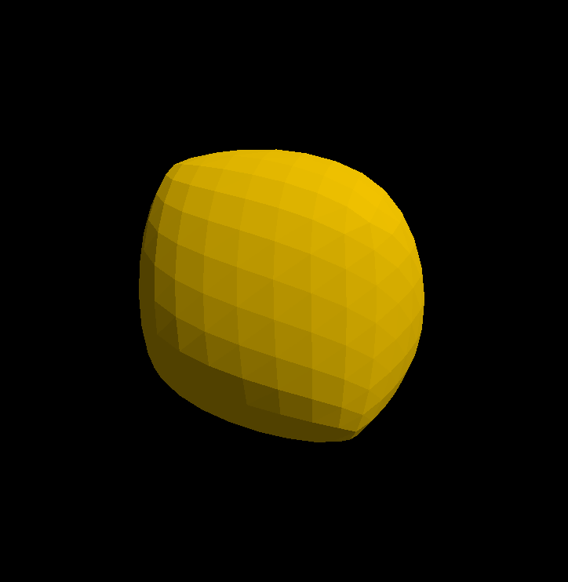
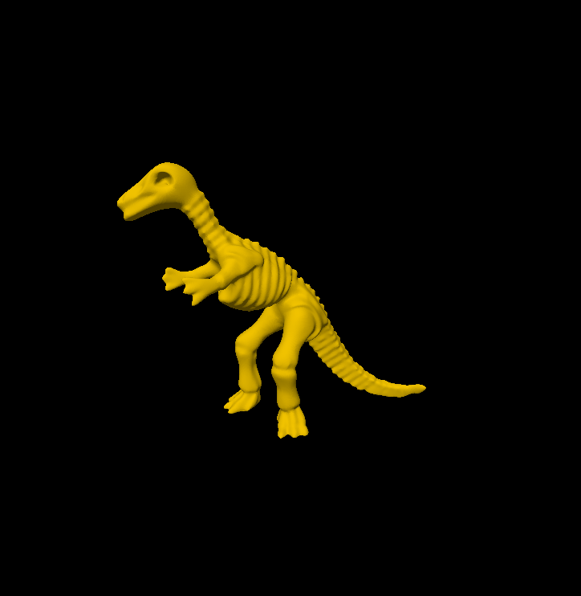
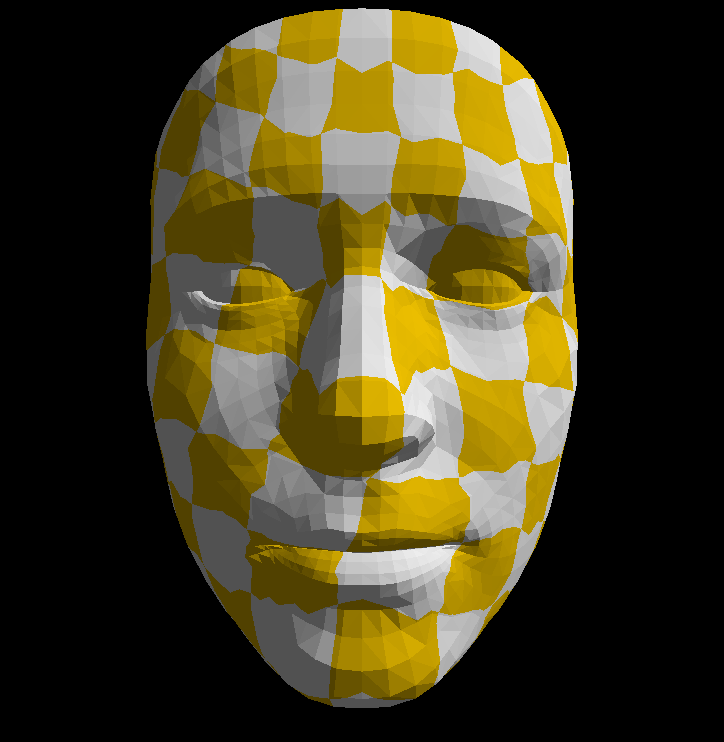
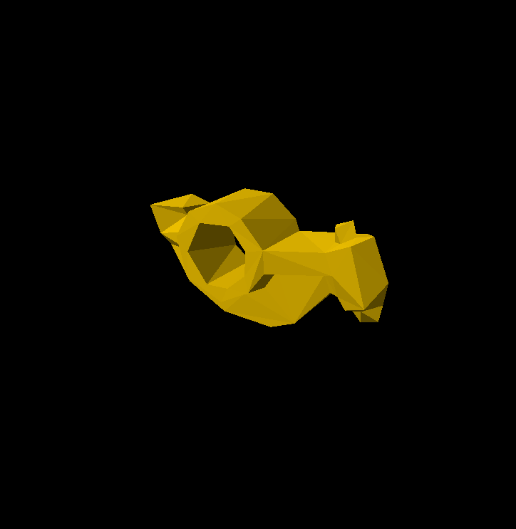
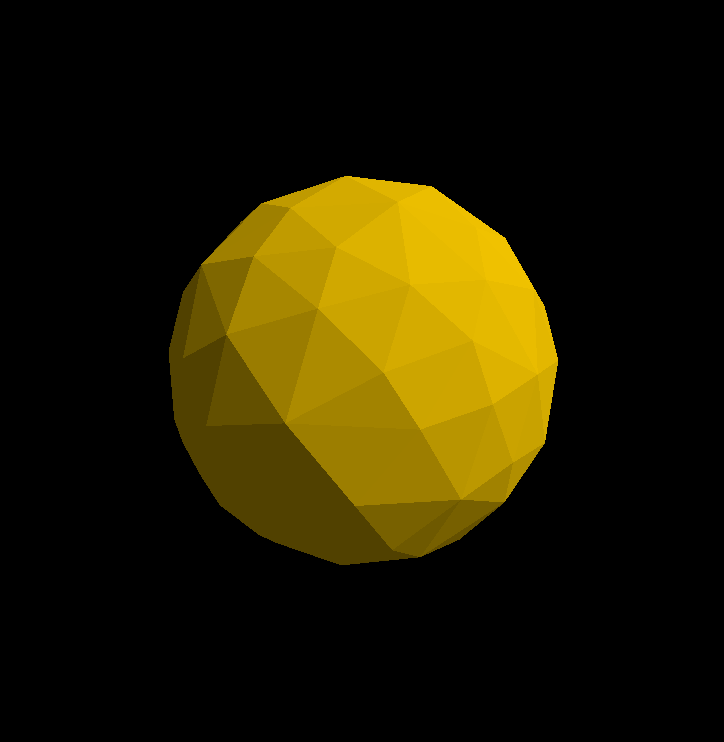
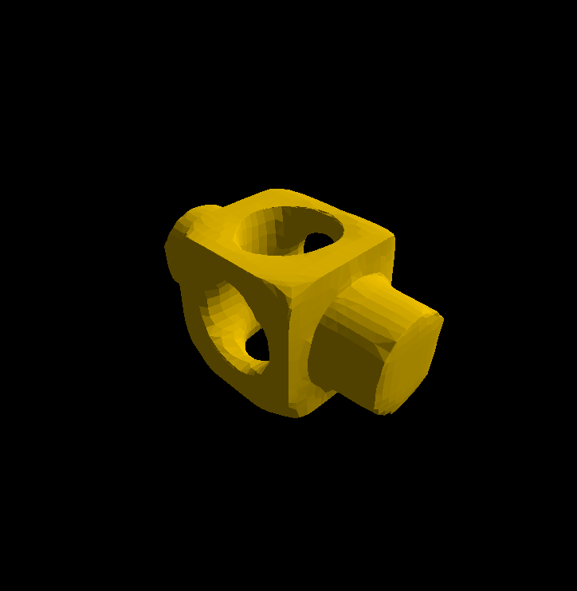
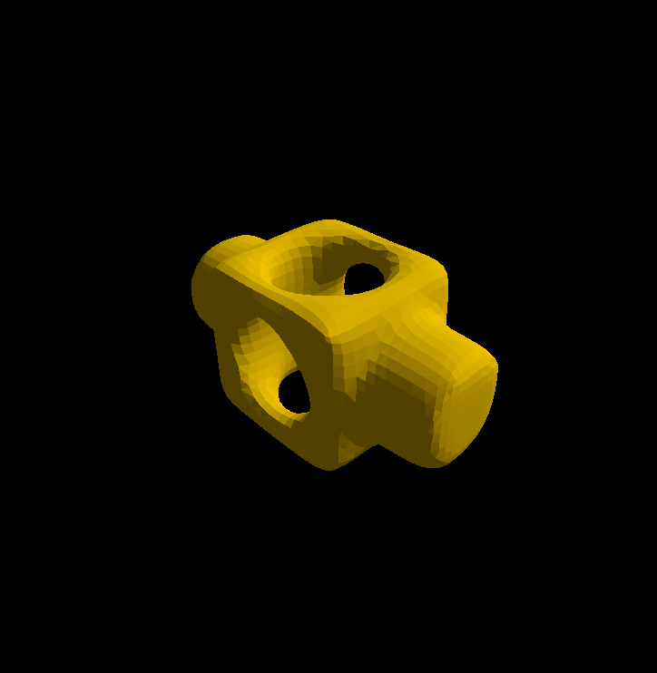
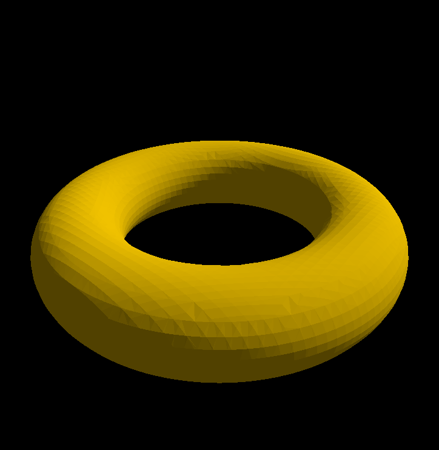

## Lab 2

汤谨丞 2400012962

### Task1:Loop Mesh Subdivision

#### 实现思路

1. **为当前 Mesh 建立半边数据结构；**

   将上一轮迭代结果从curr_mesh移入prev_mesh，并预先为已经清空的curr_mesh开好空间。

2. **对于原有的每个顶点，将它们加入到新 Mesh 中，在新 Mesh 中重新计算它们的位置； **

   遍历所有prev_mesh里的点，使用

   ```C++
   n=(v->Neighbors()).size()
   ```

   考察其相邻顶点的数目n，并用如下公式算出新顶点的坐标，推入curr_mesh的点集中。
   $$
   \vec{v}^\ast=(1-nu)\vec{v}+\sum_{i=1}^{n}u\vec{v}_i\\
   u=\begin{cases}
       3/16,&n=3\\
       3/(8n),&n>3
   \end{cases}
   $$
   
3. **遍历原有的每一条边，在边上产生新的顶点，计算它们的位置；**

   使用

   ```C++
   auto eTwin = e->TwinEdgeOr(nullptr);
   ```

   判断他是否为边界边。

   如果是，则新顶点位置是两个端点的平均值，推入curr_mesh的点集中。

   否则，可以用如下公式计算新顶点坐标。
   $$
   \vec{v}^\ast=\frac{3}{8}(\vec{v}_1+\vec{v}_2)+\frac{1}{8}(\vec{v}_3+\vec{v}_4)\ \\
   $$
   其中v1,v2是边的两个端点，v3,v4是与该边和对偶边相对的顶点。

   ```C++
   v1:prev_mesh.Positions[e->From()]
   v2:prev_mesh.Positions[e->To()])
   v3:prev_mesh.Positions[e->NextEdge()->To()]
   v4:prev_mesh.Positions[eTwin->PrevEdge()->From()]
   ```

   并额外维护一个newIndices二维数组用来记录新点与哪个面有关。对于一条边来说，和其两个半边所属的面都有关。

4. **建立新的边和新的面；**

   遍历每一个面，现在它上面有三个更新过的老顶点v0,v1,v2和三个新顶点m0,m1,m2。按照拓扑顺序把他们连接起来成为新的边并构成新的面。

5. **重复 1~4 步，直到迭代次数达到上限。**

#### 实现效果

<div style="display: flex; justify-content: space-between; align-items: flex-start; flex-wrap: nowrap;">
  <figure style="text-align: center; width: 48%; margin: 0;">
    
    <figcaption><em>Figure 1: Cube, iteration=3</em></figcaption>
  </figure>
  <figure style="text-align: center; width: 48%; margin: 0;">
    
    <figcaption><em>Figure 2: Dinosaur, iteration=3</em></figcaption>
  </figure>
</div>


### Task 2: Spring-Mass Mesh Parameterization

#### 实现思路

1. **为初始 input Mesh 建立半边数据结构，检查网格上的边界点（具体来说，只被一个三角形面包含的边，其两个端点被称为边界点）；**

   从G.Vertex(0)开始找，找到第一个边界顶点。找到后使用BoundaryNeighbors函数不断找他的边界点推入boundary_vertices数组，直至重新回到第一个边界顶点。另外为了后续使用索引查找方便，使用visited数组记录某索引的点是否为边界点。 

2. **初始化边界点上的 UV 坐标，初始化为圆边界； **

   为所有边界上的点均匀赋值为圆边界，该圆以(0.5,0.5)为圆心，0.5位半径。

   注意，这里必须是按照点的索引顺序（也就是遵循顶点的拓扑顺序）赋值才不会导致边界的扭曲。

3. **迭代求解中间点上的 UV 坐标，简单起见使用平均系数作为仿射组合系数，随后通过 Gauss-Seidel 迭代求解方程组。 **

   遍历所有点，如果该点是内部顶点，他的坐标需要求解线性方程组，并使用平均系数作为仿射组合系数。
   $$
   \vec{t}_i-\dfrac{1}{n}\sum_{\vec{t}_j\in\Omega\left(\vec{t}_i\right)}\vec{t}_j={0}
   $$
   每次迭代，认为周围所有的未知数（也就是相邻顶点的参数化坐标）都已经是最佳答案，把他们直接代入方程解出这一轮的值。

#### 实现效果

<p align="center">
  
  <br>
  <em>Figure 3：Iteration=1000</em>
</p>


### Task 3: Mesh Simplification

#### 实现思路

1. **按照论文第五节的说明，为每个初始顶点计算二次代价矩阵 `Qi` ； **

   首先计算每个面的Kp矩阵。注意到平面方程Ax+By+Cz+D=0的系数(A,B,C)恰好就是单位法向量。因此只需要取平面上的两个向量`v1-v0`和`v2-v0`做叉乘再归一化即可得到(A,B,C)，它乘以它的转置得到Kp矩阵。

   遍历所有面，每个面的顶点的`Qi`矩阵都加上该面的Kp矩阵。

2. **选择所有坍缩后仍然保持网格拓扑结构的顶点对，作为合法的顶点对； **

3. **对于每一个合法的顶点对 `vi,vj` 求解最优的坍缩位置 `v'` ，并计算它的代价 `cost = v'.T * (Qi + Qj) * v'` ； **

   对于一对合法点对:

   ```C++
   Q=Q1+Q2
    =[[q11,q12,q13,q14],
      [q21,q22,q23,q24],
      [q31,q32,q33,q34],
      [q41,q42,q43,q44]];
   Qbar=[[q11,q12,q13,q14],
         [q21,q22,q23,q24],
         [q31,q32,q33,q34],
         [0,  0,  0,  0]];
   ```

   算出Qbar并检查他是否可逆（注意glm::mat4是列优先存储）。

   如果不可逆，就找v1 v2和他们的中点中cost最小的作为`v'`

   否则解线性方程组
   $$
   \vec{v^*}=(Qbar)^{-1}\begin{bmatrix}0&0&0&1\end{bmatrix}^{\text{t}}
   $$

4. **用数组保存这些顶点对，迭代地从中取出代价最小的那一对进行顶点合并操作，直到剩余顶点的数量小于所需的比例。**

   对于边的合并操作，认为保留`v1=edge->From()`，删除`v2=edge->To()`。因此要对v1周围的环绕边进行遍历，以此遍历v1周围的所有面和面上所有的点，更新面的Kp矩阵、点的Qi矩阵以及v1本身的Qi矩阵。最后，对于更新好的v1以及它周围的点们，遍历这些点周围的环，重新构建顶点对。如果发现改动后不能保持网格拓扑结构，就把这个点对删除。

#### 实现效果

<div style="display: flex; justify-content: space-between; align-items: flex-start; flex-wrap: nowrap;">
  <figure style="text-align: center; width: 48%; margin: 0;">
    
    <figcaption><em>Figure 4: Rocker, simplify=4</em></figcaption>
  </figure>
  <figure style="text-align: center; width: 48%; margin: 0;">
    
    <figcaption><em>Figure 5: Sphere, simplify=4</em></figcaption>
  </figure>
</div>


### Task 4: Mesh Smoothing

#### 实现思路

1. **对每个顶点 `vi` ，计算相邻顶点位置的加权平均**

   **其中使用 Uniform Laplacian 时相邻顶点权重均为 1 ，使用 Cotangent Laplacian 时采用余切权重 `wij = cot ⍺ij + cot βij`；**

   首先需要计算cot值。给定以vAngle为顶点的角v1-vAngle-v2，可以使用构成角度的两个向量`edge_vector1`,`edge_vector2`的点积除以叉积来计算cot。

   当cot逼近无穷大时，直接返回0;当cot小于0时，返回绝对值。

   实践表明，对于cot值做一个clamp函数限制似乎在效果上没有太大的差别。

   ```C++
   glm::vec3 edge_vector1=v1-vAngle;
   glm::vec3 edge_vector2=v2-vAngle;
   float denom = glm::length(glm::cross(edge_vector1, edge_vector2));
   float dedot = glm::dot(edge_vector1, edge_vector2);
   if (denom < 1e-8f) return 0.0f;
   if (dedot < 0.0f) dedot= -dedot;
   float cot = std::clamp(dedot / denom, 0.0f, 10.0f);
   return dedot / denom;
   ```

   接下来就是遍历每个点，对每个点通过遍历围绕他的环边`edge=G.Vertex(i)->Ring()`，并通过`edge->From()`来获取相邻顶点。

   对于cot值，可以用`edge->To()`来获取第一个vAngel点

   用`prev_mesh.Positions[edge->PrevEdge()->TwinEdge()->NextEdge()->To()];`来获取第二个vAngel点

2. **更新顶点： `vi = (1 - λ) * vi + λ * vi'` ； **

3. **重复1，2直至到达规定的迭代次数**

#### 实现效果

<div style="display: flex; justify-content: space-between; align-items: flex-start; flex-wrap: nowrap;">
  <figure style="text-align: center; width: 48%; margin: 0;">
    
    <figcaption><em>Figure 6: Block, cotangent weight, iteration=10, smoothness=0.5</em></figcaption>
  </figure>
  <figure style="text-align: center; width: 48%; margin: 0;">
    
    <figcaption><em>Figure 7: Block, uniform weight, iteration=10, smoothness=0.5</em></figcaption>
  </figure>
</div>


### Task 5: Marching Cubes

#### 实现思路

1. **为网格结构的边建立查询其上有无 mesh 顶点的数据结构； **

   遍历像素点(x,y,z)，对于每个立方体，查询当前立方体各个顶点的sdf正负，如果是负的，就在8位二进制数字v该位置0，便于后续查表；

2. **判断哪些边上有 mesh 的顶点； **

   从c_EdgeStateTable中查出该立方体的面的情况，遍历该立方体的12条边，如果发现该边有交点，则使用

   ```C++
   start=base + dx * (j & 1) * unit(((j >> 2) + 1) % 3) + dx * ((j >> 1) & 1) * unit(((j >> 2) + 2) % 3);
    end=start + dx * unit((j >> 2) % 3);
   ```

   计算出该边的起终点，并使用对两个端点sdf值的线性插值算出sdf为0的位置，以此算出新点的位置。注意，因为同一条边会被多个立方体扫到，所以不能反复存储，否则会影响后续面的处理。故设置vector型数组`edges`记录被处理过的边，每次要加新顶点时要扫描一遍寻找该顶点是否已经被添加过，如果有，就使用已有的索引进行下一步操作。

3. **根据交点建立三角形**

   对2中取出的交点，按照边序号存储在vector型数组`idx_of_new_vertices`里，遍历该面对应的`c_EdgeOrdsTable`得到面的构成顶点，按照顺序推入`output.Indices`.

#### 实现效果

<div style="display: flex; justify-content: space-between; align-items: flex-start; flex-wrap: nowrap;">
  <figure style="text-align: center; width: 48%; margin: 0;">
    
    <figcaption><em>Figure 8:Sphere, resolution=100</em></figcaption>
  </figure>
  <figure style="text-align: center; width: 48%; margin: 0;">
    
    <figcaption><em>Figure 9:Turos, resolution=53</em></figcaption>
  </figure>
</div>