# Lab 3

汤谨丞 2400012962

### Task 1: Phong Illumination

#### 实现思路

Phong光照模型和Blinn-Phong光照模型对于环境光和漫反射的计算方法是一样的，区别在于对镜面反射的处理。

Phong光照模型认为镜面反射的差距角是镜面反射光线和观察光线的夹角，公式如下：
$$
I=k_aI_a+k_d\left(I_d+\dfrac{I_p}{r^2}\right)\max(\vec{l}\cdot\vec{n},0)+k_s\left(I_d+\dfrac{I_p}{r^2}\right)\max(\vec{v}\cdot\vec{r},0)^\alpha\
$$
Blinn-Phong光照模型认为镜面反射的差距角是法线和入射出射光线角平分线的夹角，公式如下：
$$
I=k_aI_a+k_d\left(I_d+\dfrac{I_p}{r^2}\right)\max(\vec{l}\cdot\vec{n},0)+k_s\left(I_d+\dfrac{I_p}{r^2}\right)\max(\vec{n}\cdot\vec{h},0)^\alpha\
\\其中\vec{h}=normalize(\vec{l}+\vec{v})
$$
对于漫反射和镜面反射，都需要逐个遍历点光源和平行光，最后对每个光源的着色效果进行累加。点光源和平行光的不同主要在于他们的光照强度是否需要考虑由于半径增加导致的衰减。在点光源的循环中，有如下语句用于计算与距离相关的衰减：

```C++
float attenuation  = 1. / (u_AttenuationOrder == 2 ? dist * dist : (u_AttenuationOrder == 1  ? dist : 1.));
```

**1.环境光**

```C++
 vec3  total = u_AmbientIntensity * u_AmbientScale * diffuseColor;
```

此处u_AmbientIntensity是环境光强度I_a，diffuseColor其实是漫反射系数k_d，但是近似地代替了环境光系数k_a,u_AmbientScale表示环境光项所占的比例。

**2.漫反射**

```C++
 vec3 diffuse = max(dot(normal, lightDir), 0.0) * lightIntensity * diffuseColor;
```

**3.镜面反射**

对于Phong光照：

```C++
vec3 reflectDir = reflect(-lightDir, normal);//此处已经是归一化的向量
vec3 specular = pow(max(dot(viewDir, reflectDir), 0.0), shininess) * lightIntensity * specularColor;
```

对于Blinn-Phong光照：

```C++
vec3 halfDir = normalize(lightDir + viewDir);//归一化角平分线向量
vec3 specular = pow(max(dot(normal, halfDir), 0.0), shininess) * lightIntensity * specularColor;
```

#### 回答问题

**1.顶点着色器和片段着色器的关系是什么样的?顶点着色器中的输出变量是如何传递到片段着色器当中的?**

顶点着色器负责处理顶点的位置变化、计算顶点颜色等；片段着色器负责计算像素的颜色。

顶点着色器声明为out的变量会传递给光栅化步骤自动插值，再传递给片段着色器声明为in的同名变量。

**2.代码中的 `if (diffuseFactor.a < .2) discard;` 这行语句，作用是什么？为什么不能用 `if (diffuseFactor.a == 0.) discard;` 代替？**

进行透明度测试，对于比较透明的物体可以忽略。忽略阈值不设置为0是为了压缩或采样后带一点模糊，防止半透明表面出现错误渲染。

#### 实现效果

<div style="display: flex; justify-content: space-between; align-items: flex-start; flex-wrap: nowrap;">
  <figure style="text-align: center; width: 48%; margin: 0;">
    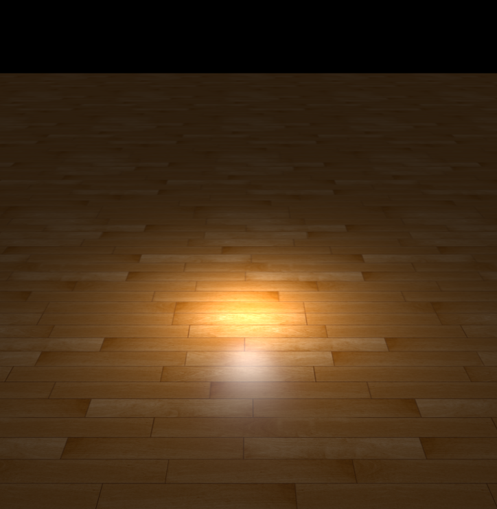
    <figcaption><em>Figure 1: floor with Phong illumation</em></figcaption>
  </figure>
  <figure style="text-align: center; width: 48%; margin: 0;">
    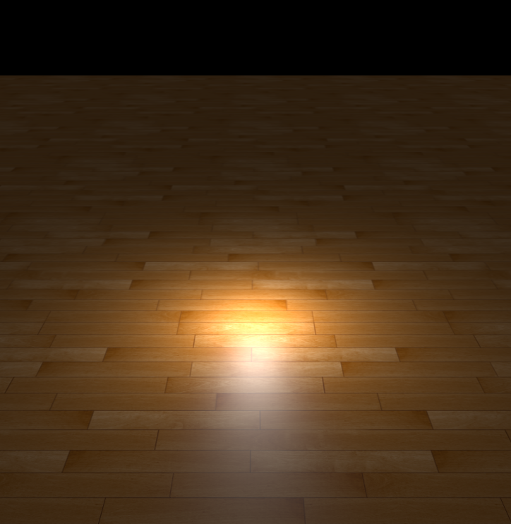
    <figcaption><em>Figure 2: floor with Phong-Blinn illumation</em></figcaption>
  </figure>
</div>


<div style="display: flex; justify-content: space-between; align-items: flex-start; flex-wrap: nowrap;">
  <figure style="text-align: center; width: 48%; margin: 0;">
    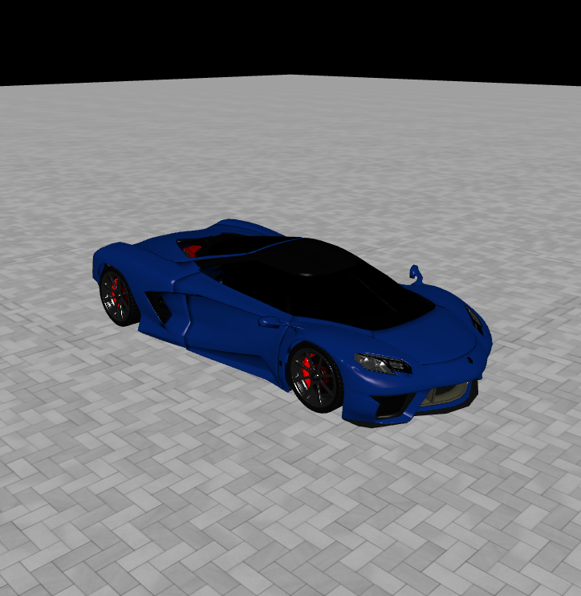
    <figcaption><em>Figure 3: car with Phong illumation</em></figcaption>
  </figure>
  <figure style="text-align: center; width: 48%; margin: 0;">
    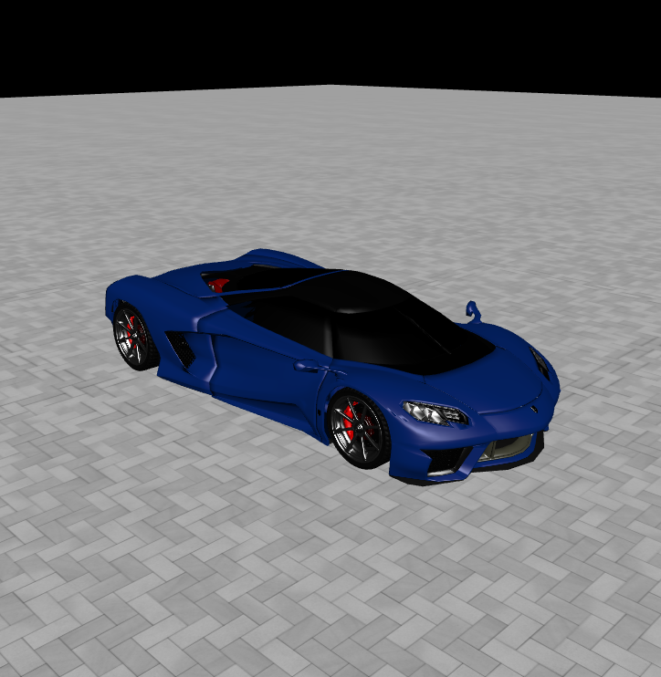
    <figcaption><em>Figure 4: car with Phong-Blinn illumation</em></figcaption>
  </figure>
</div>


### Task 1 Bonus: Bump Mapping

#### 实现思路

模型上有一个点位置为p，法线为n，凹凸贴图在该点对应位置给出了一个高度h，则渲染时认为新位置p'=p+h·n，同时需要更新法线的位置。

论文给出的数学公式较为繁杂，推导如下图所示：

<p align="center">
  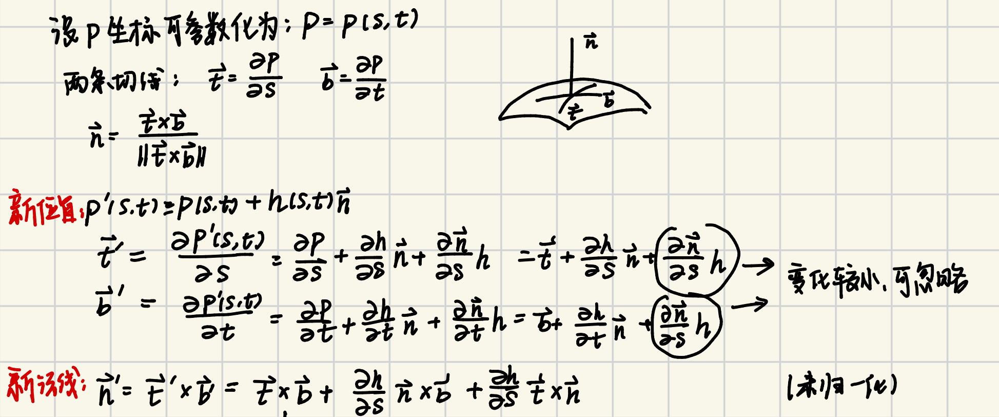
  <br>
  <em>Figure 5</em>
</p>

最终实现中，s和t分别取了屏幕坐标x,y。

```C++
vec3 posDX = dFdx(v_Position);
vec3 posDY = dFdy(v_Position);
```

posDX和posDY分别表示了p坐标关于屏幕坐标x和y的偏导数。

```C++
float Hll = texture(u_HeightMap, v_TexCoord).r;//当前片元高度
float Hlr = texture(u_HeightMap, v_TexCoord + dFdx(v_TexCoord)).r;//x方向相邻片元高度
float Hul = texture(u_HeightMap, v_TexCoord + dFdy(v_TexCoord)).r;//y方向相邻片元高度
// 计算局部梯度
float dHdX = (Hlr - Hll);
float dHdY = (Hul - Hll);
```

dHdX和dHdY分别表示了贴图中关于屏幕坐标x和y的偏导数。

#### 实现效果

<div style="display: flex; justify-content: space-between; align-items: flex-start; flex-wrap: nowrap;">
  <figure style="text-align: center; width: 48%; margin: 0;">
    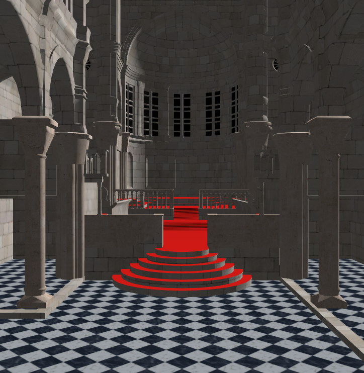
    <figcaption><em>Figure 6: sebenik without bump mapping</em></figcaption>
  </figure>
  <figure style="text-align: center; width: 48%; margin: 0;">
    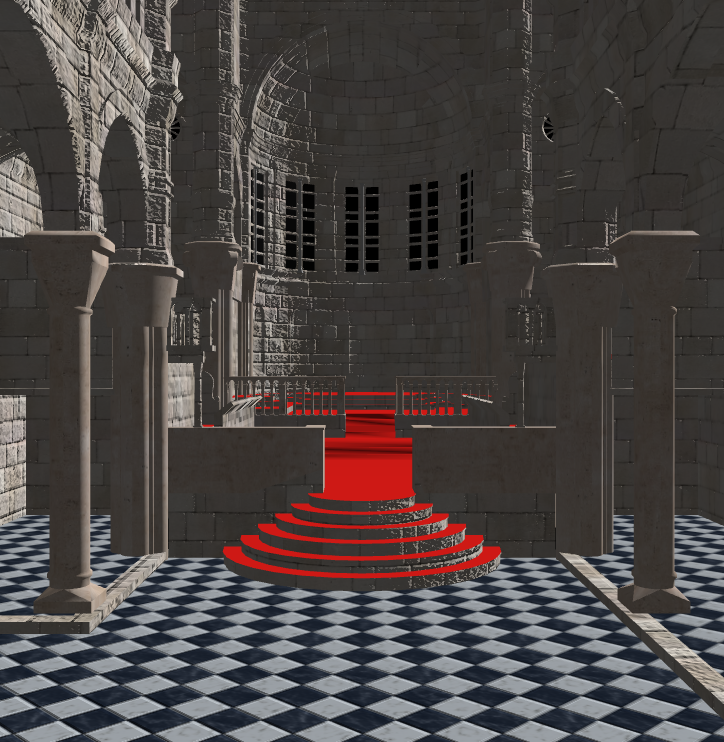
    <figcaption><em>Figure 7: sebenik with 50% bump mapping</em></figcaption>
  </figure>
</div>


### Task 2: Environment Mapping

#### 实现思路

用一张立方体纹理来表示远处的环境，这样就不用对远处的环境做真实渲染。

这个立方体纹理只会随相机旋转而选择，不会移动，而且会被设置为最大深度，给我们一种它来自无限远的幻觉，让我们以为我们身处一个无限的巨大空间之中。

这个立方体纹理有6张图，边缘无缝对接。通过方向向量来查找对应的纹理。

**立方体贴图的顶点处理器**

```C++
v_TexCoord  = a_Position;//立方体方向向量传递给纹理作为立方体贴图的方向向量
mat4 view = mat4(mat3(u_View));// 去掉平移分量
vec4 pos = u_Projection * view * vec4(a_Position, 1.0);//投影变换
gl_Position = pos.xyww;// 保证透视除法后z值为1.0，即最大深度值，使得天空盒总在最远处
```

**渲染物体时的片段处理器**

和task1中大体相同，唯一的不同是要处理环境贴图采样。

```C++
total += texture(u_EnvironmentMap, reflect(-viewDir, normal)).rgb * u_EnvironmentScale;
```

此处对于反射光做了环境贴图采样，乘上了u_EnvironmentScale调节反射光占比的多少。

#### 实现效果

<div style="display: flex; justify-content: space-between; align-items: flex-start; flex-wrap: nowrap;">
  <figure style="text-align: center; width: 48%; margin: 0;">
    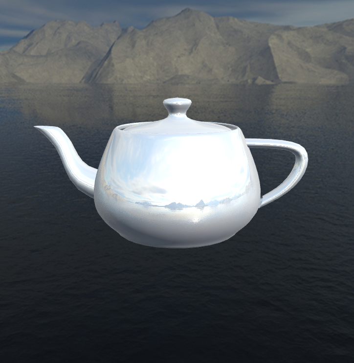
    <figcaption><em>Figure 8: teapot</em></figcaption>
  </figure>
  <figure style="text-align: center; width: 48%; margin: 0;">
    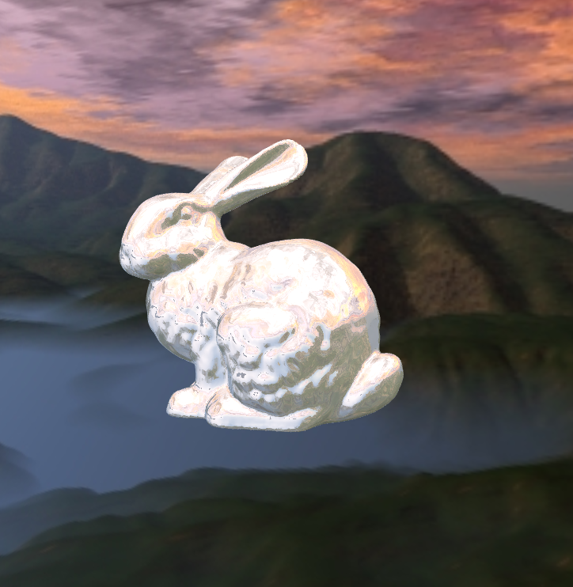
    <figcaption><em>Figure 9: bunny</em></figcaption>
  </figure>
</div>


### Task 3: Non-Photorealistic Rendering

#### 实现思路

**程序化几何法**

背面扩展：每个顶点在法向上移动一定距离，要求在屏幕上看起来等距，这样才能保证线宽看起来一样。

```C++
vec4 clipPos = u_Projection * u_View * vec4(a_Position, 1.);//计算裁剪空间位置
vec3 clipNorm = mat3(u_Projection) * mat3(u_View) * a_Normal;//计算得到屏幕（像素坐标系）下的法向量，因为是向量，所以不做平移和缩放
vec2 offset = normalize(clipNorm.xy) / vec2(u_ScreenWidth, u_ScreenHeight) * u_LineWidth * clipPos.w * 2;
 //只取法线在屏幕平面上的方向（在屏幕上沿法线方向膨胀），并进行根据屏幕尺寸进行归一化（避免长宽比例导致的线宽不同，因为给出的u_LineWidth是像素宽度，而clipNorm.xy把长宽都归一化了
 //再乘以线宽和w分量（实际上是按照深度调整偏移量）进行缩放使得屏幕上看起来近处和远处的线宽保持一致
clipPos.xy += offset;//原位置加上扩展量
gl_Position = clipPos;
```

正面保持正常。

**艺术化着色**

按照Gooch着色模型,取定冷色k_cold和暖色k_warm。物体上各点的颜色通过插值得到:
$$
k=\left(\dfrac{1+\vec{l}\cdot\vec{n}}{2}\right)k_c+\left(\dfrac{1-\vec{l}\cdot\vec{n}}{2}\right)k_w
$$
为了有较为明显的分段效果，需要对k进行离散化。

```C++
float t=(1+dot(lightDir, normal)) * 0.5;
if(t<0.333) t=0.0;
else if(t<0.7) t=0.5;
else t=0.8;
return mix(u_CoolColor, u_WarmColor, t);
```

#### 回答问题

**1.参考 Labs/3-Rendering/CaseNonPhoto.cpp 中的 `OnRender` 函数，代码是如何分别渲染模型的反面和正面的？**

先在背面渲染一次，剔除了正面并进行了膨胀；再在正面渲染一次，剔除了背面（默认），并使用了深度测试（避免画出被遮挡的正面）

**2.npr-line.vert 中为什么不简单将每个顶点在世界坐标中沿着法向移动一些距离来实现轮廓线的渲染？这样会导致什么问题？**

世界坐标系到屏幕坐标系映射是非线性的，在世界坐标系中沿法向移动一段距离会导致渲染出来在屏幕上显示的轮廓线粗细不均。

#### 实现效果

<p align="center">
  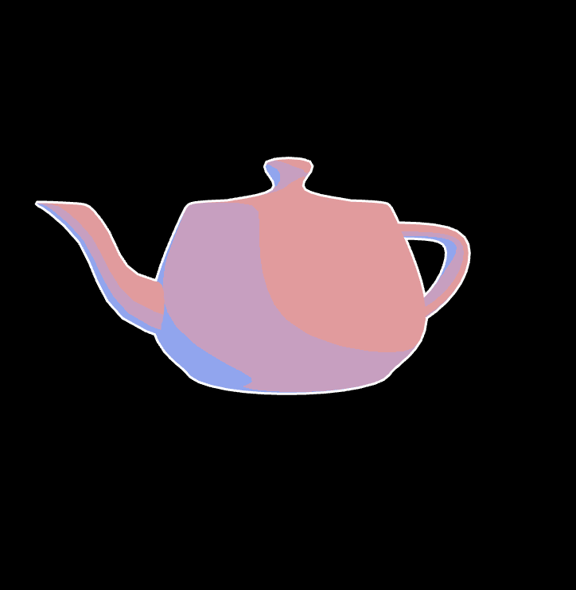
  <br>
  <em>Figure 10: Non-Photorealistic Rendering</em>
</p>


### Task 4: **Shadow Mapping**

#### 实现思路

**1.生成阴影贴图**

假定每个光源处有个相机对整个场景进行拍照，认为被看到的地方在光照中，看不到的地方在阴影里。可以将这张图的深度图作为纹理图片记录。

**平行光**

顶点着色器负责将视角转换为光源投影空间，片段着色器无需记录颜色，只需剔除透明片段。

**点光源**

顶点着色器：未做投影变换

几何着色器：光从一点发射，可以有6张深度贴图，故需要渲染6个面。face从0遍历到5，每个面都做视角转换到光源投影空间。

片段着色器：丢弃透明片段，计算该点到点光源的距离，除以u_Far_Plane将深度归一化到[0,1]，写入几何着色器指定的深度缓冲位置。

**2.对阴影贴图采样计算光照**

大体流程和正常渲染一样，采用Blinn-Phong光照模型。对平行光和点光源都需要增加对阴影贴图的采样，如果该点在阴影中，则无需着色（环境光除外）；否则则需要着色。用Shadow函数判断该点在不在阴影中。

**平行光**

```C++
vec3 pos = lightSpacePosition.xyz / lightSpacePosition.w;//把齐次坐标剪裁到[-1,1]范围内
pos = pos * 0.5 + 0.5;//把坐标转换到[0,1]范围内
float closestDepth = texture(u_ShadowMap, pos.xy).r;
```

pos.xy表示在阴影贴图中采样的位置，采样得到的即是该片段在光源下的最近深度closestDepth，pos.z表示该片段在光源下的当前深度。比较二者，如果pos.z>closestDepth则是阴影。

**点光源**

```
vec3 toLight = pos - lightPos;
float closestDepth = texture(u_ShadowCubeMap, toLight).r;//采样得到的深度是标准化后[0,1]范围内的值
closestDepth *= u_FarPlane;
float curDepth = length(toLight);
```

toLight表示在阴影贴图中采样的方向向量，采样得到的深度是标准化后的值，需要乘以u_FarPlane还原，得到的即是这个光源在该像素的最近深度closestDepth，length(toLight)则表示该片段在光源下的当前深度。比较二者，如果length(toLight)>closestDepth则是阴影。

#### 回答问题

**1.想要得到正确的深度，有向光源和点光源应该分别使用什么样的投影矩阵计算深度贴图？**

有向光源用正交矩阵，点光源用透视投影矩阵。

**2.为什么 phong-shadow.vert 和 phong-shadow.frag 中没有计算像素深度，但是能够得到正确的深度值？**

pos.z和closestDepth都是使用同一个投影矩阵算出来的归一化的值，相对大小保持不变，比较仍有意义。

#### 实现效果

<div style="display: flex; justify-content: space-between; align-items: flex-start; flex-wrap: nowrap;">
  <figure style="text-align: center; width: 48%; margin: 0;">
    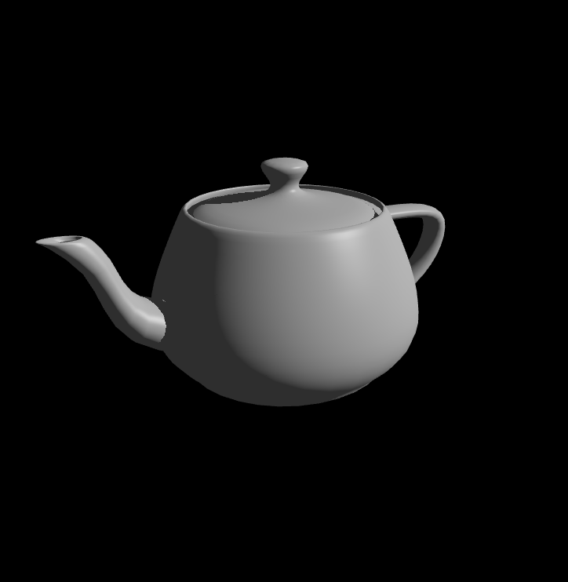
    <figcaption><em>Figure 11: teapot</em></figcaption>
  </figure>
  <figure style="text-align: center; width: 48%; margin: 0;">
    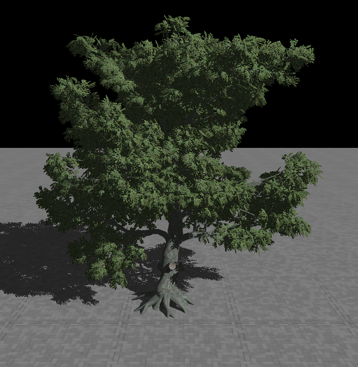
    <figcaption><em>Figure 12: oak tree</em></figcaption>
  </figure>
</div>


### **Task 5: Whitted-Style Ray Tracing**

#### 实现思路

**1.三角形求交**

使用Moller-Trumbore算法，数学细节较多，如图片所示：

<p align="center">
  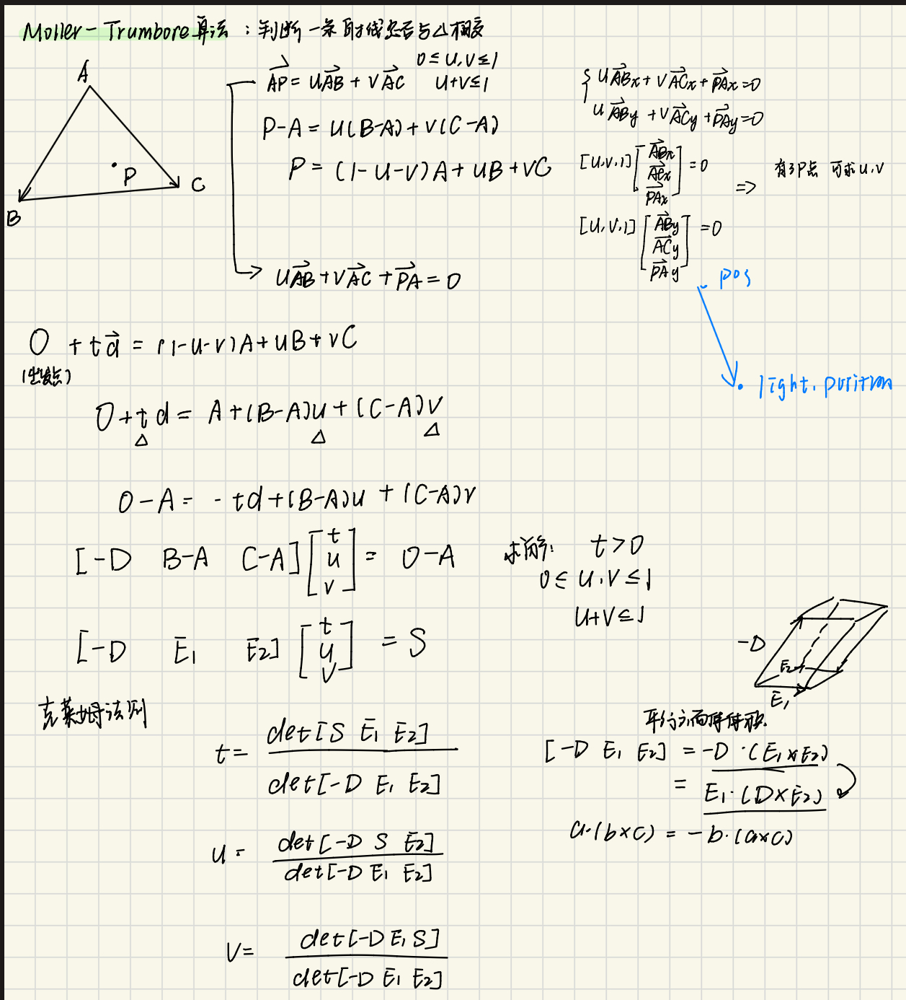
  <br>
  <em>Figure 13</em>
</p>

**2.光线追踪**

设置最大深度，每次追踪深度+1，追踪直到没打到物体或者到达最大追踪深度。

对于每次给定的追踪光线，如果没打到物体，直接返回；如果打到了物体，计算当前局部光照的结果。主要有以下几个步骤：

a.计算环境光的贡献

b.遍历光源,按照Blinn-Phong模型计算漫反射和镜面反射的贡献。如果需要做阴影判断，则观察击中点在不在阴影里不在才能进行该步和接下来的步骤。

c.根据透明度，继续折射或反射，生成新的光线进行追踪。这一步需要把ab两步的结果加到color上，但需要乘以相应追踪深度对应的权重，并为下一轮追踪更新权重。

此处光线追踪的着色和Blinn-Phong模型基本一致

**阴影判断**

在计算漫反射和镜面反射之前,需要先从击中点发射一条Shadow Ray来判断该点是否被遮挡。

**平行光**

如果该点发出的Shadow Ray与场景中的物体相交，观察该物体的透明度。如果该物体的透明度alpha>0.2,那么认为被遮挡，跳过该光源的贡献；否则继续看shadow Ray与场景中的物体是否相交，直到没有相交为止。

**点光源**

如果该点发出的Shadow Ray与场景中的物体相交，观察该物体的透明度。如果该物体的透明度alpha>0.2,那么认为被遮挡，跳过该光源的贡献；否则继续看shadow Ray与场景中的物体是否相交，直到相交点到达光源后侧。

```C++
bool inshadow=false;
while(shadowHit.IntersectState)
{
  //如果击中物体在光源后侧,说明光线已经到达光源位置,不在阴影里（对于平行光源不用这一项）
  if(glm::dot(light.Position - shadowHit.IntersectPosition, l)<0.0f)
    break;
  if(shadowHit.IntersectAlbedo.w>=0.2f)
  {
      inshadow=true;
      break;//被遮挡，跳过该光源贡献
  }                      		
  shadowRay=Ray(shadowHit.IntersectPosition,glm::normalize(l));
  shadowHit=intersector.IntersectRay(shadowRay);
}
if(inshadow) continue;
```

#### 回答问题

**1.光线追踪和光栅化的渲染结果有何异同？如何理解这种结果？**

二者都能渲染出了接近真实的效果。光栅化用投影、贴图和像素着色去模拟光学效果；光线追踪直接模拟了光线传播。总体来说光线追踪的渲染效果更为真实，但是光栅化更快，更适合实时渲染。

#### 实现效果

<div style="display: flex; justify-content: space-between; align-items: flex-start; flex-wrap: nowrap;">
  <figure style="text-align: center; width: 48%; margin: 0;">
    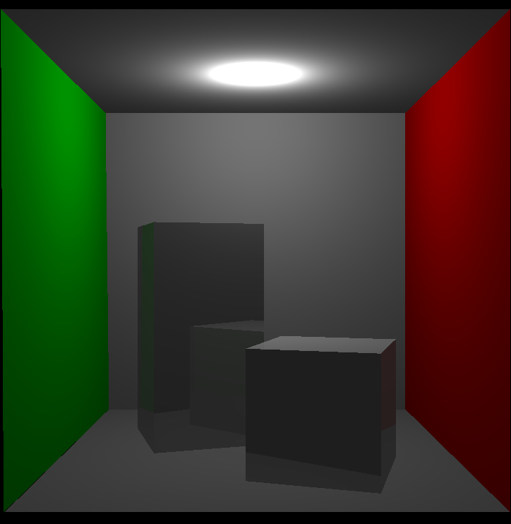
    <figcaption><em>Figure 14: cornell box without shadow</em></figcaption>
  </figure>
  <figure style="text-align: center; width: 48%; margin: 0;">
    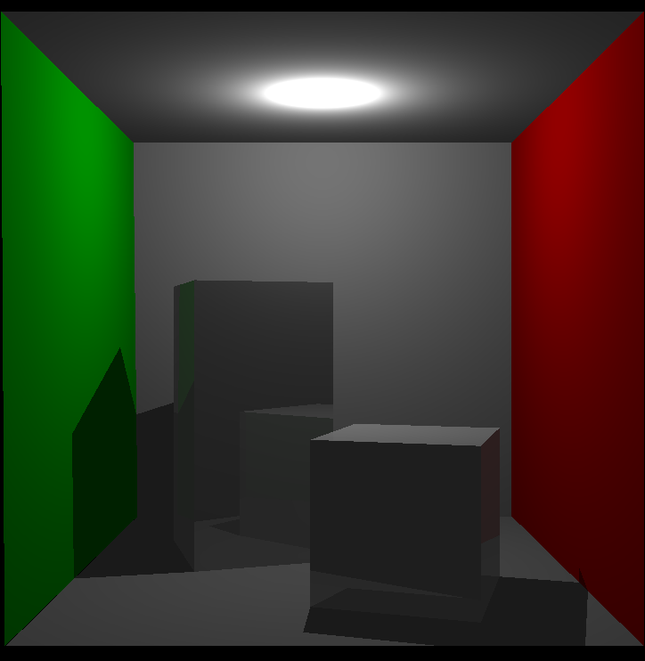
    <figcaption><em>Figure 15: cornell box with shadow </em></figcaption>
  </figure>
</div>
<p align="center">
  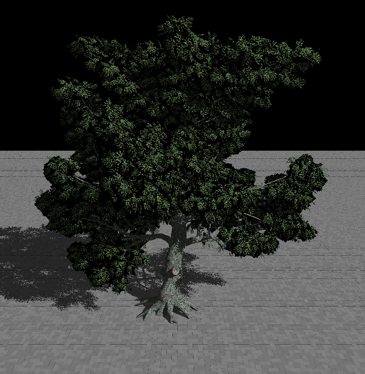
  <br>
  <em>Figure 16:oak tree with shadow</em>
</p>
