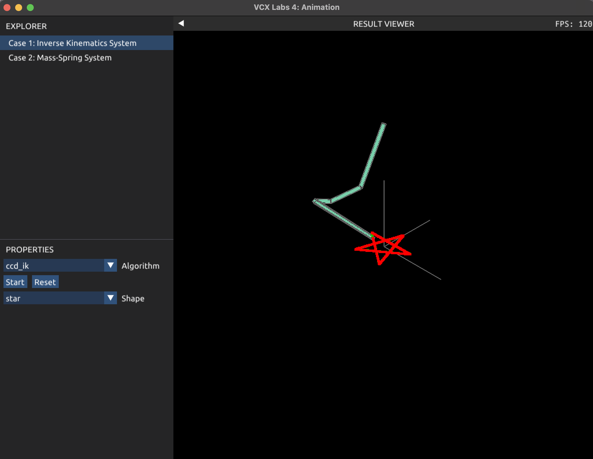
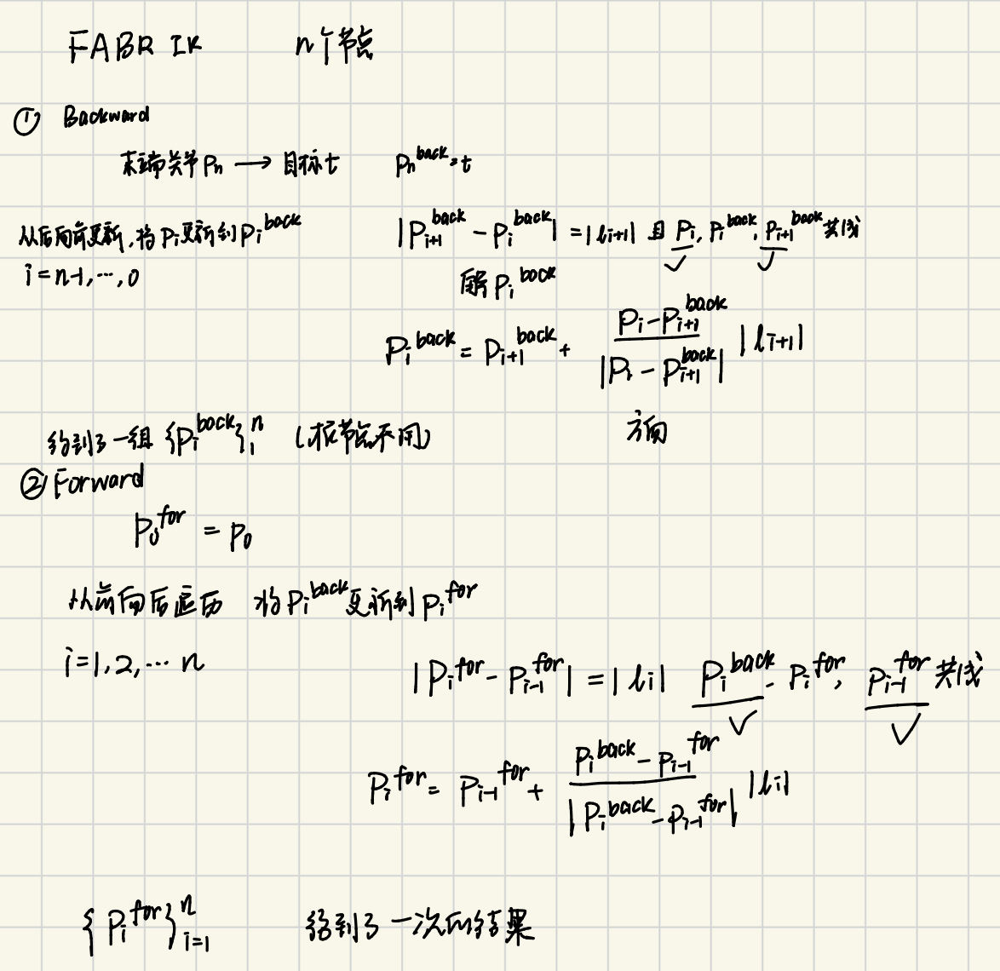
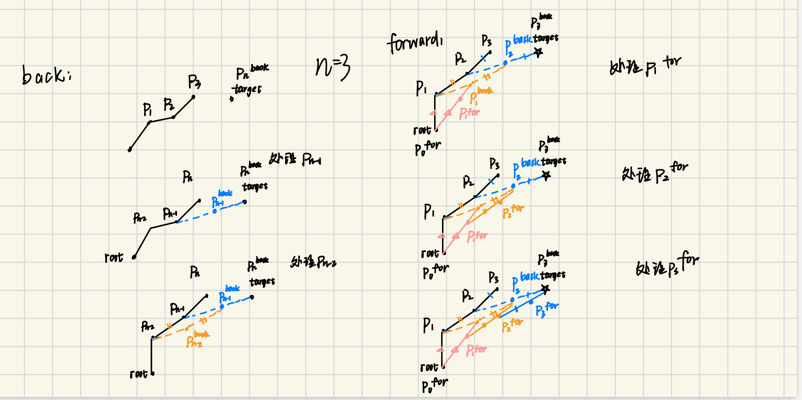
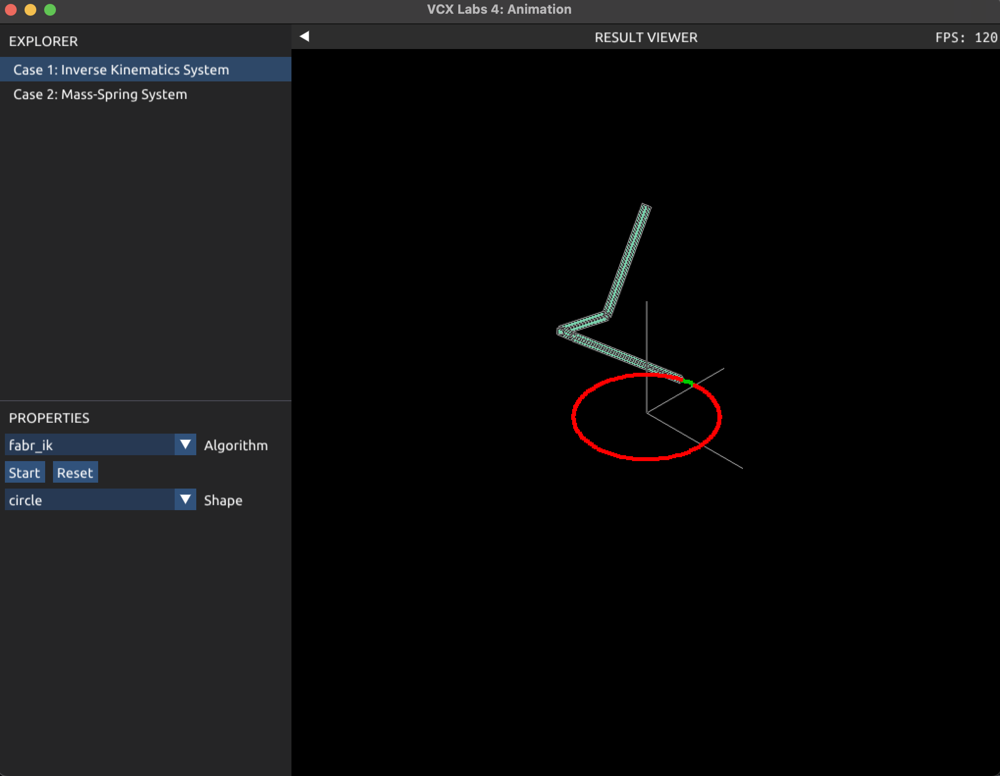
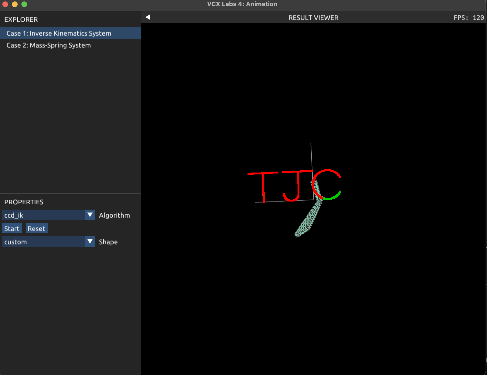
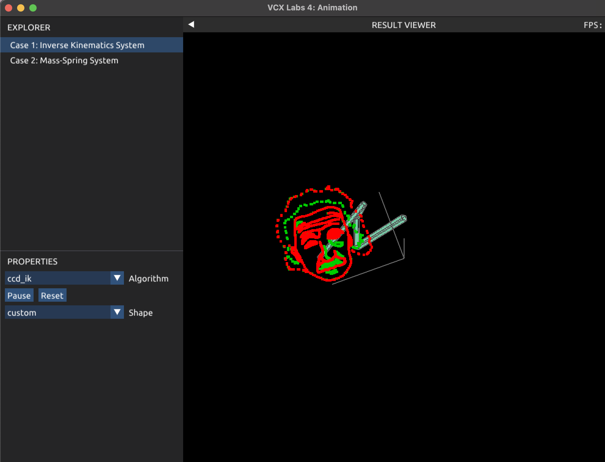
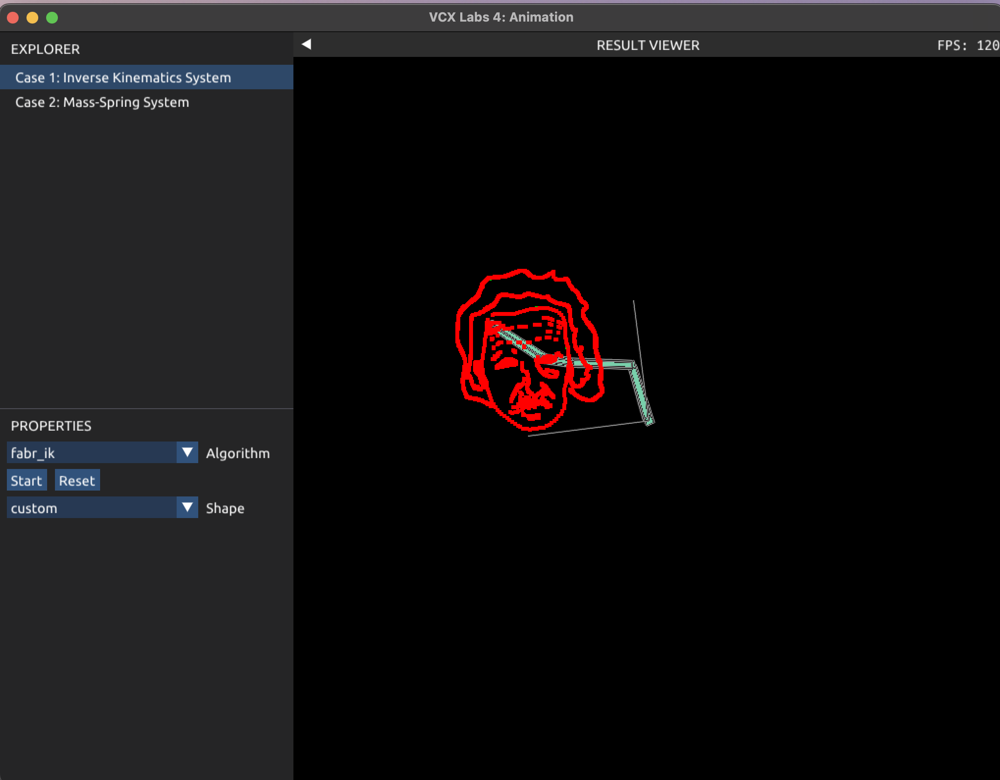
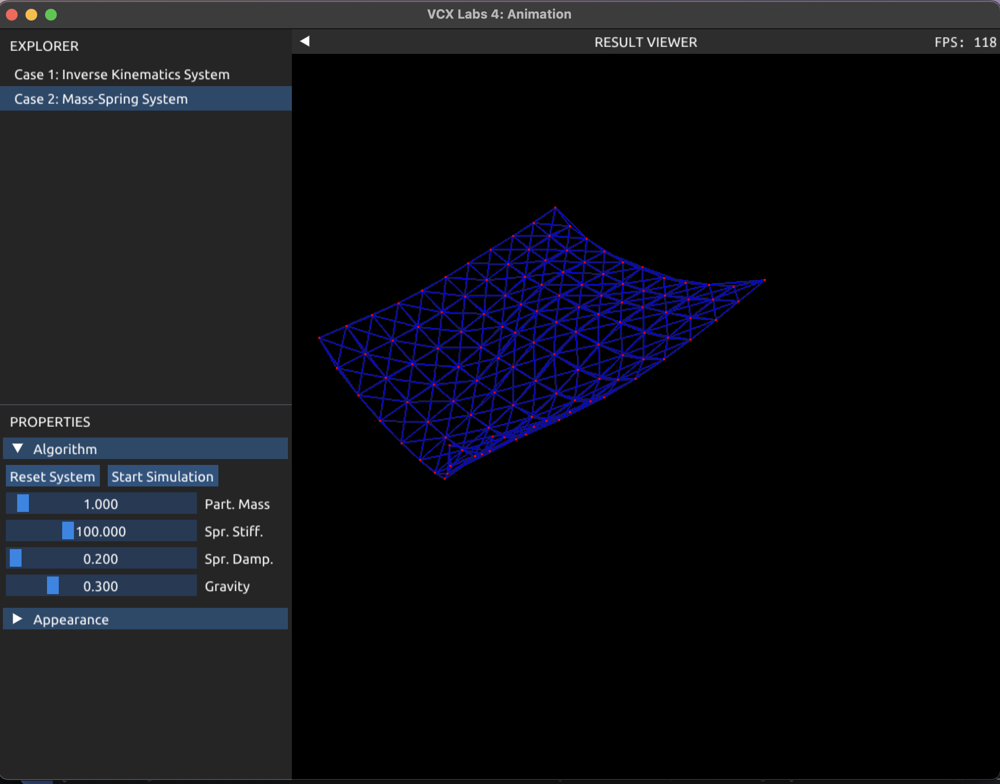

## Lab 4

汤谨丞 2400012962

### **Task 1: Inverse Kinematics** 

##### 1-1 Forward kinematic

认为该系统是一个链表结构，每个关节i只有一个父关节i-1和一个子关节i+1。

对于每一个关节，全局旋转量和全局位移量计算方式如下。注意，每一个关节的局部位移是在自己的局部坐标系下的，转化成全局位移需要考虑父关节的全局旋转。

```C++
ik.JointGlobalRotation[i] = ik.JointGlobalRotation[i - 1] * ik.JointLocalRotation[i];
ik.JointGlobalPosition[i] = ik.JointGlobalPosition[i - 1] + ik.JointGlobalRotation[i - 1] * ik.JointLocalOffset[i];
```

##### 1-2 CCD IK

从后向前遍历所有关节（从倒数第二个关节开始），对于每个关节i：

1.计算当前关节与末关节、当前关节与目标点的连线向量；

2.使用rotation函数算出将二者对齐的旋转量，更新当前关节的局部旋转

3.从关节i向后做前向运动学传播

使用CCD IK的效果如下

<p align="center">
  
  <br>
  <em>Figure 1</em>
</p>

##### 1-3 FABR IK

算法流程和图示如下

<p align="center">
  
  <br>
  <em>Figure 2-1</em>
</p>

<p align="center">
  
  <br>
  <em>Figure 2-2</em>
</p>

使用FABR IK的效果如下

<p align="center">
  
  <br>
  <em>Figure 2-3</em>
</p>


##### 1-4 自定义曲线

仿照给出的BuildCustomTargetPosition函数，修改xval和yval的值，并用下列语句保存：

```C++
(*custom)[index++] = glm::vec3(x_val, 0.0f, y_val);
```

我绘制了我的姓名首字母TJC。T只需要横竖两条直线；J需要一条横线，一条竖线和一个半圆；C则是取了一个圆的一部分。效果如下。

<p align="center">
  
  <br>
  <em>Figure 3</em>
</p>

##### Bonus task:

让采样点更均匀的方法：计算本次采样点和上次采样点的距离，如果距离超过给定的阈值len_bar=0。02f就进行跨度为len_bar的重采样。采用与不采用该方法的对比如下。

<div style="display: flex; justify-content: space-between; align-items: flex-start; flex-wrap: nowrap;">
  <figure style="text-align: center; width: 48%; margin: 0;">
    
    <figcaption><em>Figure 4：无优化，头发稀疏</em></figcaption>
  </figure>
  <figure style="text-align: center; width: 48%; margin: 0;">
    
    <figcaption><em>Figure 5: 有优化，头发均匀</em></figcaption>
  </figure>
</div>

##### 回答问题：

**1.如果目标位置太远，无法到达，IK 结果会怎样？**

IK 会把末端尽可能伸向目标，但停在机械臂能到达的最远点，例如机械臂完全伸直变成一条直线。

**2.比较 CCD IK 和 FABR IK 所需要的迭代次数**

FABR 的迭代次数更少。CCD IK更新是逐关节改善末端位置，而FABR IK直接移动整体关节坐标。FABR的收敛速度显著快于CCD，对于长链条更加明显。

**3.由于 IK 是多解问题，在个别情况下，会出现前后两帧关节旋转抖动的情况。怎样避免或是缓解这种情况？**

添加阻尼项，限制关节频繁跳跃；限制每个关节最大的旋转变化量；多解时，优先选择与上一帧接近的解。


### Task 2: **Mass-Spring System**

##### 实现思路

**1.计算内力fij和fji，加到对应点的内力上，得到forces向量即为E的负梯度**

遍历所有弹簧，得到起点p0,终点p1，计算弹力，累加到force数组。

```C++
glm::vec3 const x01 = system.Positions[p1] - system.Positions[p0];
glm::vec3 const e01 = glm::normalize(x01);
glm::vec3 f = system.Stiffness * (glm::length(x01) - spring.RestLength) * e01;//无需阻尼项
forces[p0] += f;
forces[p1] -= f;
```

**2.计算E的Hessian矩阵。**

这是一个3n*3n的矩阵，将其划分成n * n个3 * 3的子矩阵，位置(i,i)(j,j)的子矩阵为H_ij;位置(i,j)(j,i)的子矩阵为-H_ij。遍历所有弹簧，起点为p0,终点为p1

```C++
glm::vec3 const x10 = system.Positions[p0] - system.Positions[p1];
glm::vec3 const e01 = glm::normalize(x10);
float l_ij = glm::length(x10);
glm::mat3 H_ij = system.Stiffness * ( glm::outerProduct(e01, e01) + (1 - spring.RestLength / l_ij) * (glm::mat3(1.0f) - glm::outerProduct(e01, e01)) / l_ij );
```

**3.计算y_tk**
$$
\vec{y}(t_k)=\vec{x}(t_k)+\Delta t\vec{v}(t_k)+(\Delta t)^2{M}^{-1}\vec{f}_{\text{ext}}
$$
其中，认为外力全部来自于重力。

```C++
gravity.setZero();
for(int i=0;i<n;i++)
   gravity[3*i+1]=-system.Gravity;
Eigen::VectorXf y=x + dt*v + dt*dt*gravity;
```

**4.计算g的梯度和Hessian矩阵**

```C++
//构建M_diag
Eigen::SparseMatrix<float> M_diag(n * 3, n * 3);
for (int i = 0; i < n * 3; i++) 
    M_diag.insert(i, i) = system.Mass;  
//计算E的梯度
Eigen::VectorXf E_grad = -glm2eigen(forces);
//计算g的梯度
Eigen::VectorXf g_grad = 1/(dt*dt)*M_diag*(x-y)+E_grad;
//计算g的Hessian矩阵
Eigen::SparseMatrix<float> g_Hessian = 1/(dt*dt)*M_diag + H_E;
```

**5.调用ComputeSimplicialLLT函数求解线性方程组得到delta_x**
$$
[{H}_g(\vec{x}(t_k))(\vec{x}(t_{k+1})-\vec{x}(t_k))=-\nabla g(\vec{x}(t_k))
$$
**6.更新位置和速度。**

对于固定的点，不用更新。

##### 实现效果

<p align="center">
  
  <br>
  <em>Figure 6</em>
</p>