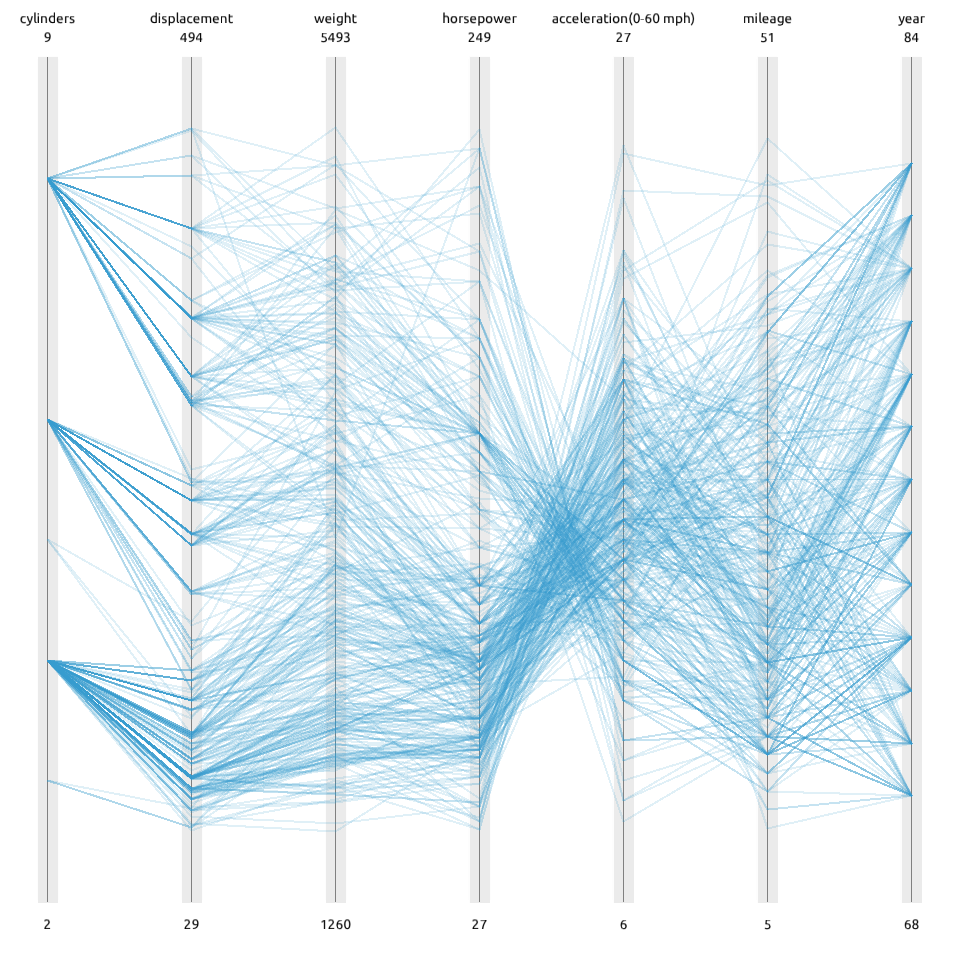
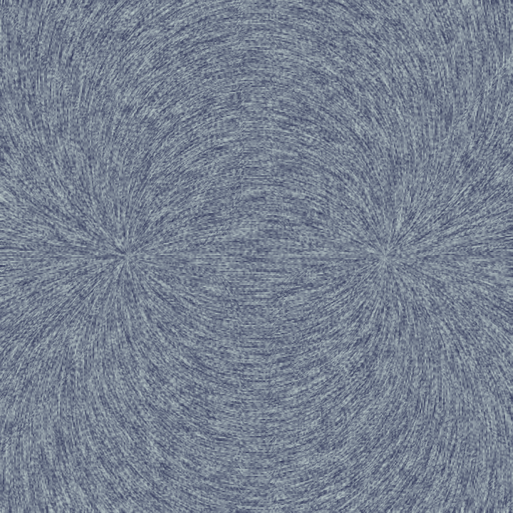
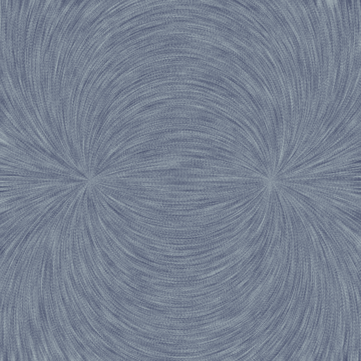
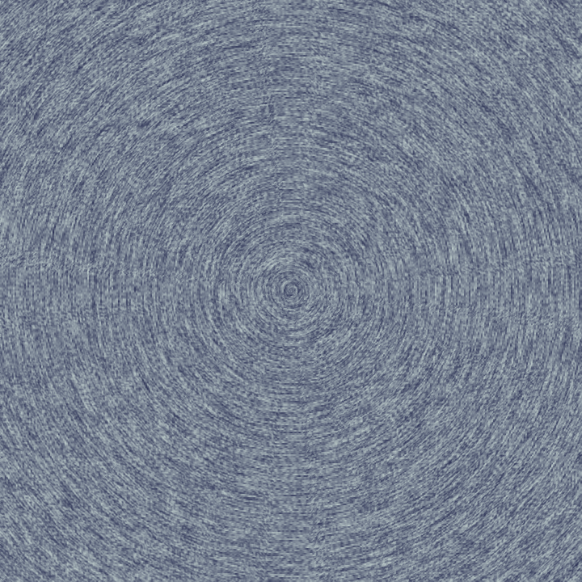
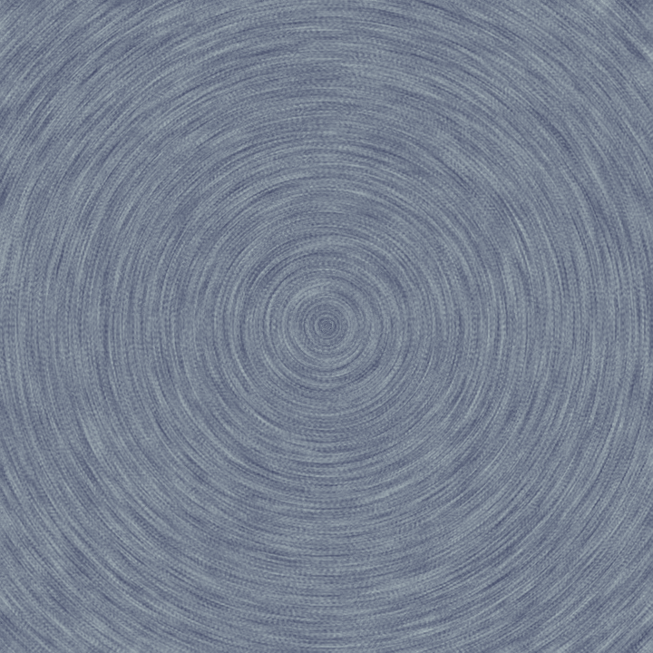
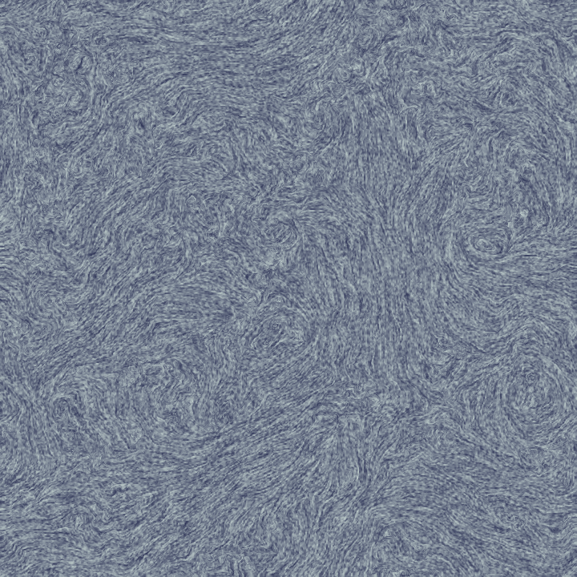
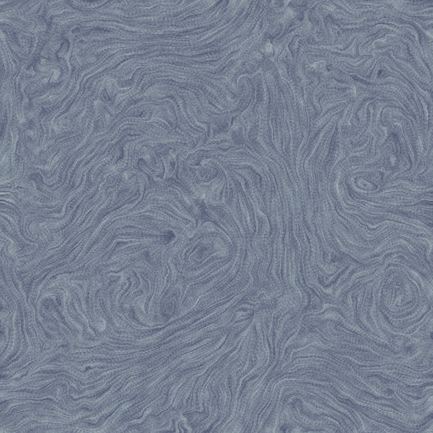

## Lab 5

汤谨丞 2400012962

### Task 1: **Parallel Coordinates Visualization**

##### 实现思路

###### CoordinateStates结构体

1.初始化函数：拆解data的7个字段并分别分别按序存在7个vector里面

2.paint_axis函数：绘制纵轴、覆盖纵轴的小矩形和上下标签

设定7个纵轴的横坐标相对位置（等距排开0.05,0.20,0.35……以此类推）、纵坐标起始和终止相对位置（7个轴都是从0.06-0.94）以及7个文本标签、7个数据最小值、7个数据最大值。

```C++
for(int i=0;i<7;i++)
{
    //画纵轴、小矩形和标签
    float x=0.05+0.15*i;
    //画小矩形并填充
    DrawRect(input,glm::vec4(0.99,0.99,0.99,0.9),glm::vec2(x-0.01,0.06),
    glm::vec2(0.02,0.88),0.01f);
    for(int i=(x-0.01)*width;i<=(x+0.01)*width;i++)
    {
        for(int j=0.06*height;j<=0.94*height;j++)
        {
            input.At(i,j)=glm::vec3(0.92,0.92,0.92);
        }
    }
    //画纵轴,得在小矩形上面画，否则会遮挡     			   
    DrawLine(input,glm::vec4(0.5,0.5,0.5,1),glm::vec2(x,0.06),glm::vec2(x,0.94),0.02f);
    //画标签
    PrintText(input,glm::vec4(0,0,0,1),glm::vec2(x,0.02),0.02f,labels[i]);
    PrintText(input,glm::vec4(0,0,0,1),glm::vec2(x,0.965),0.02f,low_range[i]);
    PrintText(input,glm::vec4(0,0,0,1),glm::vec2(x,0.04),0.02f,high_range[i]);
}
```

注意，先画小矩形再画纵轴，否则会发生遮挡。

3.paint_data函数：绘制每个数据点。

对每个数据点，根据他字段在该字段最小值-最大值之间的比例位置定点，然后连出6条线。为了便于阅读，设置线的透明度0.15.

###### PaintParallelCoordinates函数

绘制背景，构建结构体并依次调用paint_axis、paint_data函数。

```C++
static CoordinateStates states(data);
SetBackGround(input, glm::vec4(1));
states.paint_axis(input);
states.paint_data(input);
```

##### 实现效果

<p align="center">
  
  <br>
  <em>Figure 1</em>
</p>


### Task 2: **Flow Visualization**

##### 实现思路

遍历画布上每一个像素(j,i），并对每个像素进行正方向积分和反方向积分。

正方向积分：

1.取x=j,y=i,初始化权重和forward_total_weight和带权和forward_sum

2.迭代step次，每次取field记录的在([x+0.5],[y+0.5])像素位置的速度(dx,dy)，并计算沿向量方向走多远会刚好穿过一个像素边界。先撞到哪条像素边界，就走到哪，并更新位置。进行卷积，累加forward_total_weight和forward_sum。

```C++
x=std::min(std::max(x+dx*dt,0.0f),float(width)-1);
y=std::min(std::max(y+dy*dt,0.0f),float(height)-1);
glm::vec3 noise_color=noise.At((int)x,(int)y);
float weight=glm::pow(glm::cos(1+s*0.46),2);
forward_sum+=noise_color*weight;
forward_total_weight+=weight;
```

反方向同理，只是把速度(dx,dy)换成(-dx,-dy).

##### 实现效果

<div style="display: flex; justify-content: space-between; align-items: flex-start; flex-wrap: nowrap;">
  <figure style="text-align: center; width: 48%; margin: 0;">
    
    <figcaption><em>Figure 2：bipole,step=10</em></figcaption>
  </figure>
  <figure style="text-align: center; width: 48%; margin: 0;">
    
    <figcaption><em>Figure 3: bipole,step=25</em></figcaption>
  </figure>
</div>

<div style="display: flex; justify-content: space-between; align-items: flex-start; flex-wrap: nowrap;">
  <figure style="text-align: center; width: 48%; margin: 0;">
    
    <figcaption><em>Figure 4：circle,step=10</em></figcaption>
  </figure>
  <figure style="text-align: center; width: 48%; margin: 0;">
    
    <figcaption><em>Figure 5: circle,step=25</em></figcaption>
  </figure>
</div>

<div style="display: flex; justify-content: space-between; align-items: flex-start; flex-wrap: nowrap;">
  <figure style="text-align: center; width: 48%; margin: 0;">
    
    <figcaption><em>Figure 2：turbulence,step=10</em></figcaption>
  </figure>
  <figure style="text-align: center; width: 48%; margin: 0;">
    
    <figcaption><em>Figure 5: turbulence,step=25</em></figcaption>
  </figure>
</div>